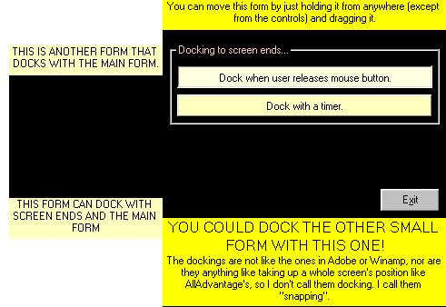



## Docking

### Description

This code shows you how to do docking or snapping (however you may like to call it). It has two docking styles -- one is with a timer and the other one is just a normal one. You can dock one form with the other, and you can also dock, any of the forms, with the screen ends.
 
### More Info
 
Just see it in the code.

OK. The forms dock to the screen ends and to each other. Simple?

All you need to know are mathematical skills (just a tiny bit) and imagination.

Docked windows. Duh!

With the timer, the docking looks crappy.

             |
---                |---
**Submitted On**   |2000-04-23 08:46:44
**By**             |[Syed Atif Ali](https://github.com/Planet-Source-Code/PSCIndex/blob/master/ByAuthor/syed-atif-ali.md)
**Level**          |Beginner
**User Rating**    |3.7 (26 globes from 7 users)
**Compatibility**  |VB 5\.0, VB 6\.0
**Category**       |[Custom Controls/ Forms/  Menus](https://github.com/Planet-Source-Code/PSCIndex/blob/master/ByCategory/custom-controls-forms-menus__1-4.md)
**World**          |[Visual Basic](https://github.com/Planet-Source-Code/PSCIndex/blob/master/ByWorld/visual-basic.md)
**Archive File**   |[CODE\_UPLOAD50954232000\.zip](https://github.com/Planet-Source-Code/syed-atif-ali-docking__1-7503/archive/master.zip)

